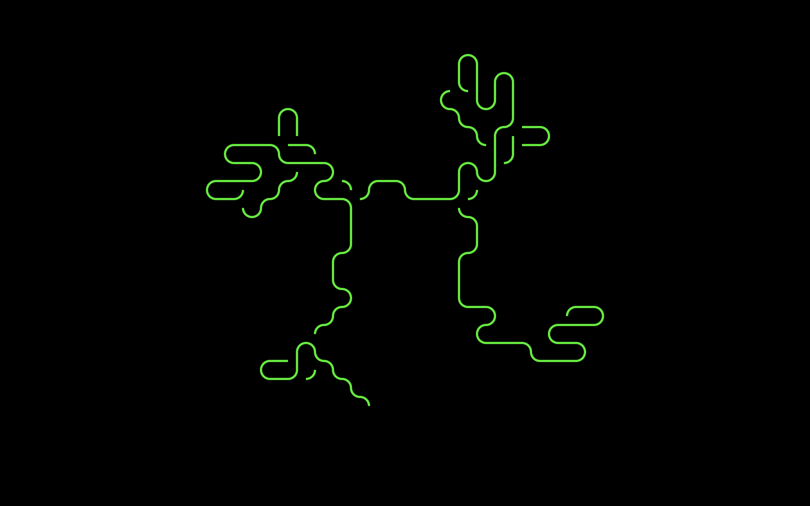

# Frutselaar

[Frutselaar for MacOS—download here](https://github.com/thomasokken/frutselaar/releases).  
For MacOS 10.13 (High Sierra) or later.

## What's Frutselaar?

Frutselaar is a screen saver for MacOS. It draws cute random patterns with fourfold rotational symmetry.

The algorithm is a re-creation of a program I remember from the Commodore PET days. I don't have the
original program any more, unfortunately. It might have originally been published by COMPUTE! magazine.
If anyone can remember the original program and point me to its source, I would be most grateful!
